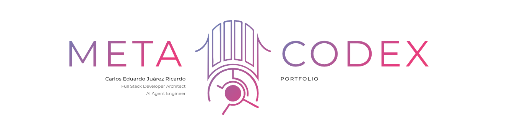
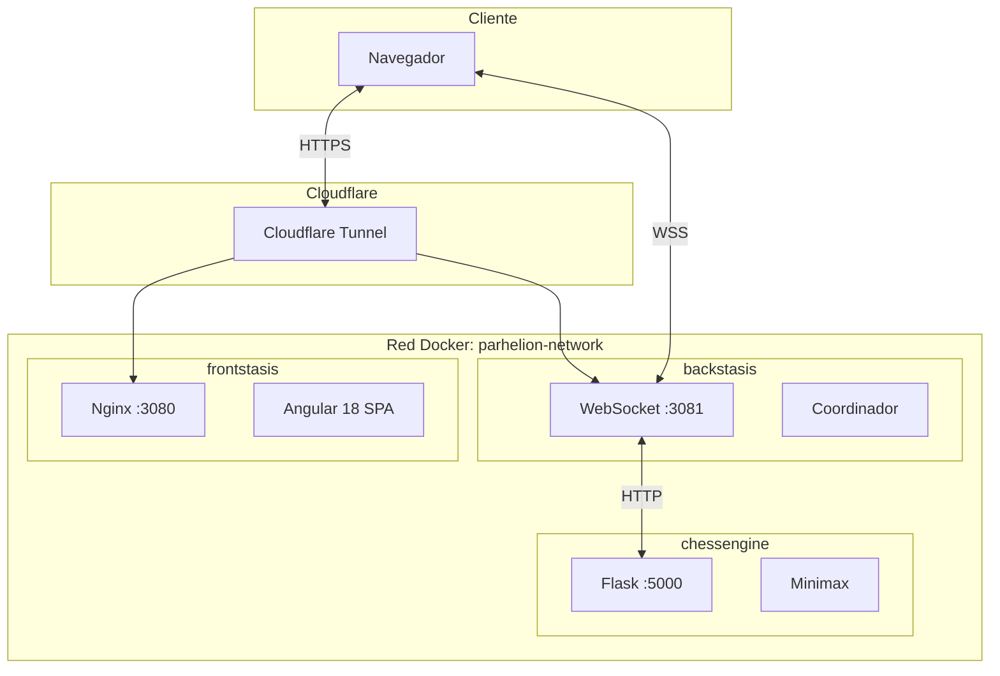
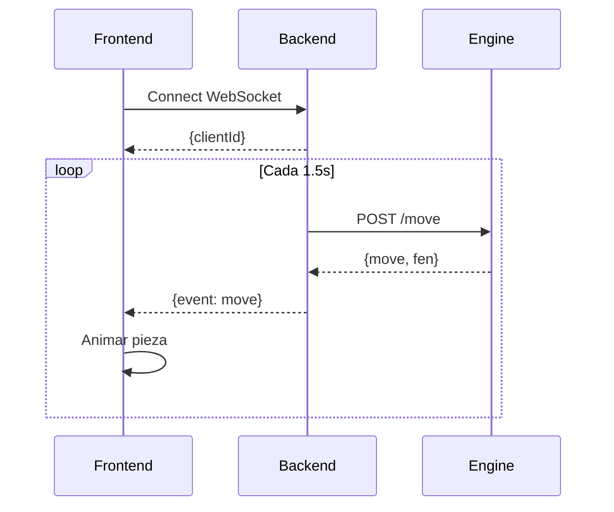
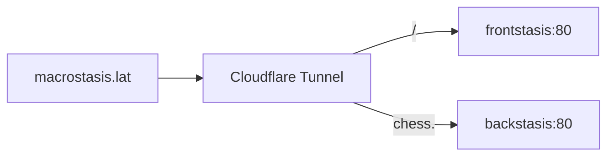

<div align="center">



# MacroStasis

**Portafolio Profesional Interactivo**

Sitio web de portafolio personal construido con arquitectura moderna, diseño premium y múltiples características interactivas que demuestran competencias en desarrollo Full Stack.

[Demo en Vivo](https://macrostasis.lat) | [Documentación](#arquitectura)

---

</div>

## Tabla de Contenidos

- [Descripción General](#descripción-general)
- [Navegación y Menús](#navegación-y-menús)
  - [Pantalla de Inicio](#pantalla-de-inicio)
  - [Menú Principal](#menú-principal)
  - [Sección Portafolio](#sección-portafolio)
  - [Sección Sobre Mí](#sección-sobre-mí)
  - [Sección Mi Stack](#sección-mi-stack)
  - [Sección Arquitectura](#sección-arquitectura)
  - [Sección Contacto](#sección-contacto)
- [Características Técnicas](#características-técnicas)
- [Arquitectura del Sistema](#arquitectura-del-sistema)
- [Stack Tecnológico](#stack-tecnológico)
- [Frontend en Detalle](#frontend-en-detalle)
- [Backend en Detalle](#backend-en-detalle)
- [Instalación](#instalación)
- [Configuración](#configuración)
- [Despliegue](#despliegue)

---

## Descripción General

MacroStasis es un portafolio profesional que va más allá del contenido estático. Combina técnicas avanzadas de frontend con una arquitectura de microservicios para crear una experiencia interactiva y visualmente impactante.

### Filosofía de Diseño
- **Estética "Into the Dream"**: Minimalismo inspirado en Vaporwave/City Pop
- **Fondo Blanco Limpio**: Con gradiente aurora boreal animado
- **Tipografía Elegante**: Montserrat para una apariencia profesional
- **Interactividad Sutil**: Animaciones que responden al usuario sin distraer

---

## Navegación y Menús

### Pantalla de Inicio

La primera impresión del portafolio, diseñada para captar la atención del visitante.

**Elementos Visuales:**
- Logo central SVG personalizado que funciona como punto focal
- Textos "META" y "CODEX" posicionados a los lados con efecto parallax
- Fondo con gradiente aurora boreal animado (colores: morado, rosa, azul, verde)
- Indicador de scroll con flechas animadas en la parte inferior

**Interacciones:**
- Al hacer scroll (0-400px), los textos laterales se desvanecen y salen de pantalla
- El logo crece progresivamente (scale 1 → 1.8) mientras se centra
- Efecto parallax diferencial: cada elemento se mueve a velocidad distinta

**Optimizaciones:**
- Precarga de assets en background usando `requestIdleCallback`
- GPU acceleration para animaciones fluidas sin jank

---

### Menú Principal

Aparece cuando el usuario hace scroll suficiente (80% del progreso).

**Elementos:**
| Botón | Función | Gradiente |
|-------|---------|-----------|
| Portafolio | Ver proyectos desarrollados | Rosa → Naranja |
| Sobre Mi | Información personal y profesional | Morado → Azul |
| Mi Stack | Tecnologías dominadas | Azul → Verde |
| Arquitectura | Demostración técnica (próximamente) | Verde → Amarillo |
| Contacto | Información de contacto + Ajedrez | Multicolor |

**Características del Menú:**
- Fade-in suave al aparecer (0.8 → 1.0 del progress)
- Cada botón tiene gradiente único para diferenciación visual
- Versión móvil: barra inferior con iconos compactos
- Selector de idioma (ES/EN) integrado

**Iconos de Redes Sociales:**
- Posición: esquinas superiores de la pantalla
- Redes: LinkedIn, GitHub, Instagram, Email, Web personal
- Efecto hover con escala y cambio de opacidad

---

### Sección Portafolio

Showcase de proyectos profesionales desarrollados.

**Proyectos Incluidos:**

#### 1. Parhelion Logistics
- **Tipo**: Plataforma B2B de Logística (WMS + TMS) nivel Enterprise
- **Stack**: .NET 8, Python, Angular, React, PostgreSQL, Docker, FastAPI, n8n
- **Características**:
  - Sistema SaaS multi-tenant para transporte B2B
  - Gestión de flotas: DryBox, Refrigerado, HAZMAT, Blindado
  - Documentación legal mexicana (Carta Porte, POD digital)
  - 10 módulos de análisis predictivo
  - Agentes de IA para crisis management

#### 2. MacroStasis Portfolio
- **Tipo**: Portfolio Interactivo con Estética Minimalista
- **Stack**: Angular 18, TypeScript, CSS3, Python, Node.js, Docker, WebSocket
- **Características**:
  - Standalone Components con Signals
  - Animaciones CSS avanzadas (parallax, aurora, orbital)
  - Optimización de rendimiento (OnPush, GPU acceleration)
  - Diseño responsivo mobile-first

#### 3. Proyectos Varios
- Colección de experimentos, automatizaciones y herramientas de productividad

**Navegación del Carrusel:**
- Flechas laterales para cambiar proyecto
- Indicadores de proyecto actual
- Transición animada entre proyectos

---

### Sección Sobre Mí

Presentación profesional y personal del desarrollador.

**Contenido:**

| Sección | Información |
|---------|-------------|
| Saludo | "¡Hola! Soy Carlos Eduardo Juárez Ricardo" |
| Perfil | Ingeniero de Software Full Stack → IA Agéntica |
| Personal | 22 años, Veracruz, México, Universidad Veracruzana |
| Idiomas | Español (nativo), Inglés (intermedio técnico) |

**Experiencia Técnica:**
- IA Agéntica: Workflows con n8n, LangGraph, integración de LLMs
- Backend: .NET 8 (C#), Python, FastAPI, APIs RESTful
- Bases de Datos: PostgreSQL, MySQL, SQL Server
- DevOps: Linux, Docker, Cloudflare, CI/CD
- Frontend: Angular, React Native, Tailwind CSS

**Experiencia Profesional:**
- Lead Architect @ Parhelion Logistics (2025-Presente)
- Full Stack Developer @ Microfinanciera Inpulso (2025)
- IT Specialist & Automation (2019-2024)

**Logro Destacado:**
- Ganador CTF Ubisoft Captain Laserhawk (2024) - Premio 1 ETH

---

### Sección Mi Stack

Galería interactiva de todas las tecnologías dominadas.

**Funcionamiento:**
1. Marquesina de fondo con iconos de tecnologías en movimiento
2. Panel central que muestra una tecnología a la vez
3. Rotación automática cada 5 segundos con barra de progreso
4. Navegación manual con flechas izquierda/derecha

**Información por Tecnología:**
| Campo | Descripción |
|-------|-------------|
| Icono | SVG de la tecnología |
| Nombre | Nombre completo (ej: "Angular 18") |
| Nivel | Básico / Intermedio / Avanzado / Experto |
| Años | Años de experiencia |
| Categoría | Frontend / Backend / Database / DevOps / Cloud / AI |
| Uso | Activo / Reciente / Ocasional |

**Tecnologías Incluidas (30+):**
- **Frontend**: Angular, React, TypeScript, JavaScript, HTML5, CSS3, Tailwind
- **Backend**: .NET, Python, Node.js, FastAPI, PHP, Java, C#
- **Database**: PostgreSQL, MySQL, SQL Server
- **DevOps**: Docker, Nginx, Git, Linux, GitHub Actions
- **Cloud**: Cloudflare, DigitalOcean, AWS, Azure
- **AI**: Claude API (Anthropic)
- **Automation**: n8n
- **Build Tools**: Vite

---

### Sección Arquitectura

Demostración técnica visual del proceso de desarrollo.

**Estado**: Próximamente

**Contenido Planificado:**
- Terminal simulado mostrando workflow de desarrollo
- Pasos: Creación de proyecto → Git → Docker → Deploy
- Indicador visual sincronizado con progreso
- Diagramas de arquitectura interactivos

---

### Sección Contacto

Área de contacto con elemento interactivo único: tablero de ajedrez en vivo.

**Layout:**
| Posición | Contenido |
|----------|-----------|
| Izquierda | Mitad superior del tablero de ajedrez |
| Centro | Información de contacto |
| Derecha | Mitad inferior del tablero de ajedrez |

**Información de Contacto:**
- Email: carlosjuarex@outlook.es
- LinkedIn: /in/metacodex
- GitHub: /MetaCodeX
- Botón de descarga de CV

**Tablero de Ajedrez:**
- Partida CPU vs CPU ejecutándose en tiempo real
- Comunicación WebSocket con backend
- Motor de IA Python con algoritmo Minimax
- Animación de piezas con resaltado de último movimiento
- Estado del juego visible (turno, movimiento #)
- Colores triádicos dinámicos para variedad visual

**Responsivo Móvil:**
- Layout vertical: tablero arriba, contacto al centro, tablero abajo
- Centro con fondo blanco para legibilidad
- Padding inferior para evitar controles de navegación

---

## Características Técnicas

### Optimización de Rendimiento
| Técnica | Implementación |
|---------|----------------|
| Change Detection | `ChangeDetectionStrategy.OnPush` |
| GPU Acceleration | `will-change` y `backface-visibility: hidden` |
| Asset Preloading | `requestIdleCallback` para carga idle |
| Lazy Signals | Computed signals con memoización |

### Sistema Parallax
```
Scroll Progress (0 → 400px = 0 → 1)
├── Textos META/CODEX: opacity 1→0, translateX ±150px
├── Logo: scale 1→1.8, translateY -10%
├── Menú: fade-in al 80% del progress
└── Móvil: Logo scale 1→5 para mayor impacto
```

### Sistema de Traducción
- Diccionario integrado con 50+ claves
- Soporte ES/EN con cambio instantáneo
- Método `t(key)` para acceso a traducciones
- Textos largos soportados (descripciones completas)

### Animaciones CSS
| Animación | Descripción |
|-----------|-------------|
| Aurora | Gradiente de fondo tipo aurora boreal |
| Scroll Bounce | Flechas indicadoras con rebote |
| Marquee | Desplazamiento de iconos de tecnología |
| Section Enter | Dispersión al cambiar sección |

---

## Arquitectura del Sistema



### Flujo WebSocket



---

## Stack Tecnológico

### Frontend
| Tecnología | Uso |
|------------|-----|
| Angular 18 | Standalone Components + Signals |
| TypeScript | Tipado estático |
| CSS3 | 4000+ líneas personalizadas |
| Nginx | Servidor de producción |

### Backend
| Tecnología | Uso |
|------------|-----|
| Node.js 20 | WebSocket server |
| ws | Biblioteca WebSocket |
| Axios | Cliente HTTP |

### Motor de Ajedrez
| Tecnología | Uso |
|------------|-----|
| Python 3.11 | Runtime |
| Flask | API REST |
| python-chess | Lógica de ajedrez |

---

## Frontend en Detalle

### Signals Implementados
| Signal | Propósito |
|--------|-----------|
| `_progress` | Progreso del scroll |
| `activeSection` | Sección activa |
| `currentLang` | Idioma (es/en) |
| `activeStack` | Tech en marquesina |
| `activeProject` | Proyecto en carrusel |

### Computed Signals
| Computed | Cálculo |
|----------|---------|
| `opacity` | `1 - progress * 1.5` |
| `leftX` | `-150 * progress` |
| `logoScale` | `1 + (0.8 * progress)` |
| `menuOpacity` | Fade 0.8→1.0 |

---

## Backend en Detalle

### WebSocket Server
- Validación de origen (CORS)
- Soporte para Cloudflare headers
- Auto-reinicio de partidas
- Health check `/health`

### Motor Minimax
- Profundidad: 2 niveles
- Poda Alpha-Beta
- Tablas piece-square
- Bonus de promoción: +800 (reina)
- Bonus de apertura: peones centrales

---

## Instalación

```bash
git clone https://github.com/MetaCodeX/MacroStasis.git
cd MacroStasis
docker network create parhelion-network
docker-compose up -d --build
```

Acceso: http://localhost:3080

---

## Configuración

### Variables de Entorno

#### backend/.env
```
NODE_ENV=development
PORT=80
CHESS_ENGINE_URL=http://chessengine:5000
ALLOWED_ORIGINS=http://localhost:3080
MOVE_INTERVAL_MS=1500
```

#### chessengine/.env
```
FLASK_ENV=development
PORT=5000
```

---

## Despliegue



---

<div align="center">

**Desarrollado por Carlos Eduardo Juárez Ricardo**

[GitHub](https://github.com/MetaCodeX) | [LinkedIn](https://linkedin.com/in/metacodex) | [Web](https://macrostasis.lat)

</div>
