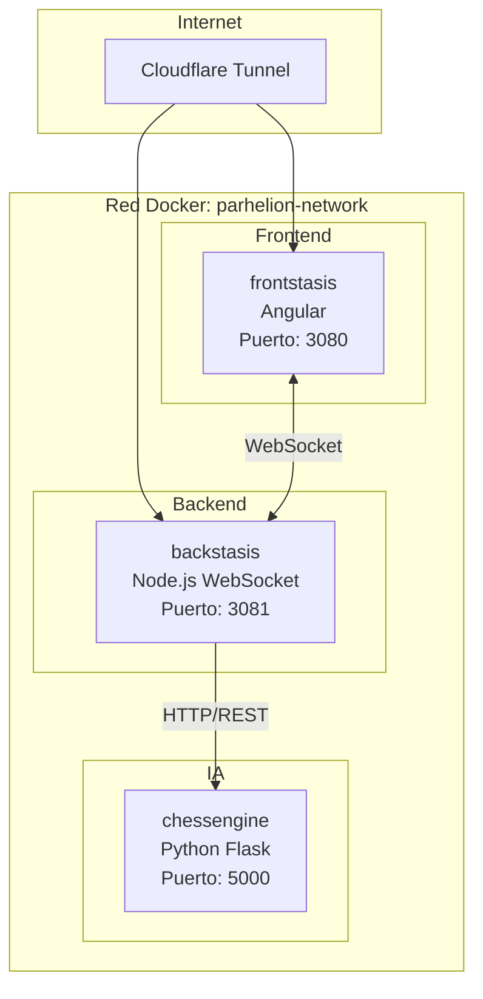
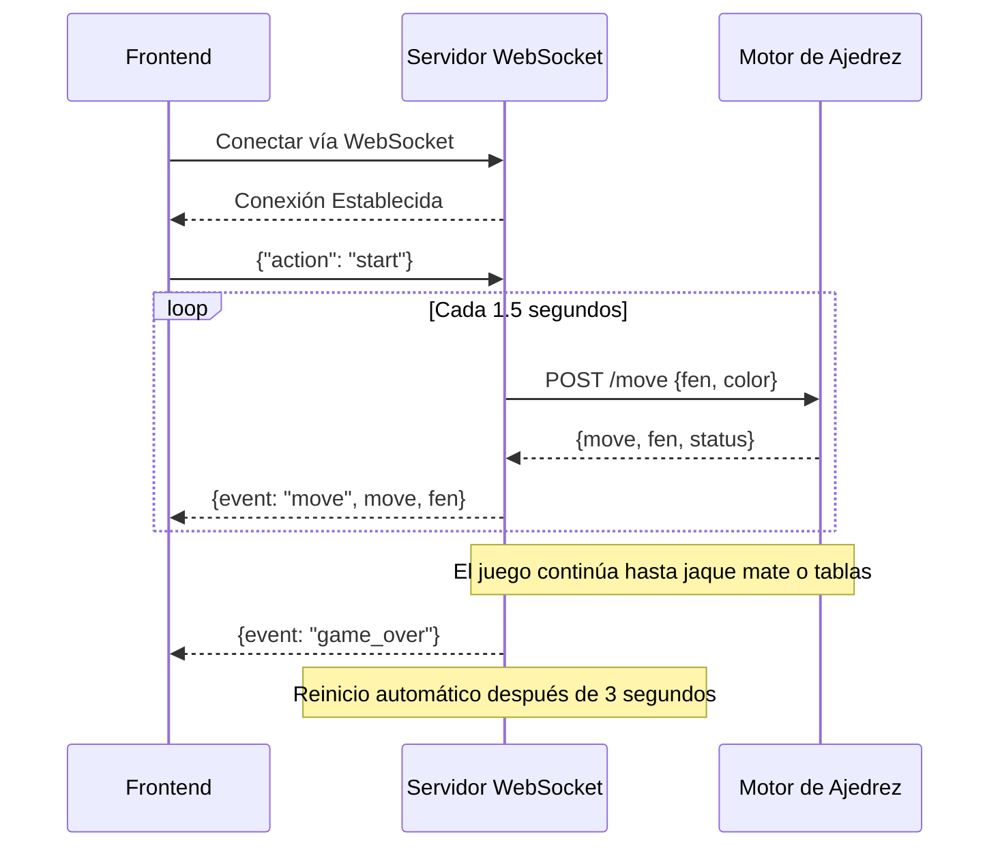
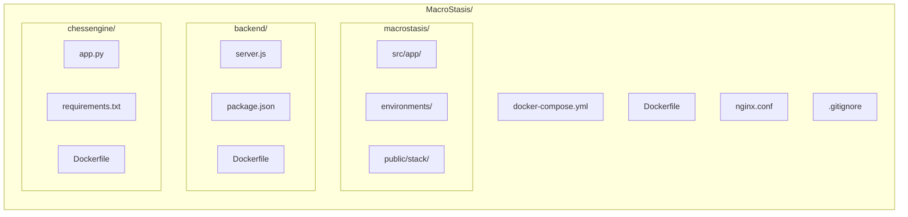
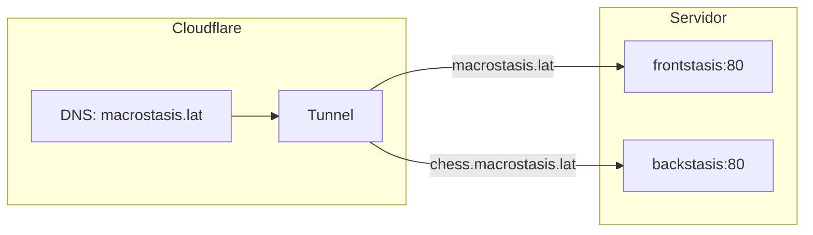

<div align="center">


# MacroStasis

**Portafolio Profesional con Animación de Ajedrez en Tiempo Real**

Un portafolio moderno y profesional que demuestra habilidades de desarrollo frontend y backend, incluyendo un juego de ajedrez en vivo impulsado por comunicación WebSocket y movimientos calculados por IA.

[Demo en Vivo](https://macrostasis.lat) | [Documentación](#arquitectura)

---

</div>

## Tabla de Contenidos

- [Descripción General](#descripción-general)
- [Características](#características)
- [Arquitectura](#arquitectura)
- [Stack Tecnológico](#stack-tecnológico)
- [Estructura del Proyecto](#estructura-del-proyecto)
- [Servicios](#servicios)
- [Instalación](#instalación)
- [Configuración](#configuración)
- [Despliegue](#despliegue)
- [Licencia](#licencia)

---

## Descripción General

MacroStasis es un sitio web de portafolio profesional que va más allá del contenido estático. Presenta un juego de ajedrez interactivo que se juega de forma autónoma en segundo plano, demostrando comunicación WebSocket en tiempo real entre un backend en Node.js y un frontend en Angular, con movimientos calculados por un motor de IA en Python utilizando el algoritmo Minimax.

El proyecto demuestra:
- Desarrollo moderno en Angular 18+ con Standalone Components y Signals
- Comunicación bidireccional en tiempo real vía WebSocket
- Arquitectura de microservicios containerizada con Docker
- Despliegue en producción a través de Cloudflare Tunnel

---

## Características

### Portafolio Interactivo
- **Diseño Responsivo**: Optimizado para dispositivos de escritorio y móviles
- **Soporte Multi-idioma**: Inglés y español con cambio dinámico
- **Animaciones Fluidas**: Animaciones y transiciones CSS en todo el sitio
- **Navegación por Secciones**: Scroll suave entre secciones del portafolio

### Juego de Ajedrez en Tiempo Real
- **Juego Autónomo**: Partida CPU vs CPU ejecutándose continuamente
- **Comunicación WebSocket**: Actualizaciones del tablero en tiempo real sin polling
- **Movimientos con IA**: Algoritmo Minimax con poda alfa-beta
- **Promoción de Peones**: Reglas completas de ajedrez incluyendo promoción de piezas
- **Animación Visual**: Movimiento animado de piezas con resaltado de posiciones

### Aspectos Técnicos Destacados
- **Esquema de Colores Triádico**: Generación dinámica de colores para variedad visual
- **Diseño Glassmorphism**: Elementos de interfaz modernos y transparentes
- **Gestión de Estado con Observables**: Arquitectura reactiva basada en RxJS
- **Monitoreo de Salud**: Endpoints de health check integrados

---

## Arquitectura



### Flujo de Datos



---

## Stack Tecnológico

### Frontend (frontstasis)
| Tecnología | Versión | Propósito |
|------------|---------|-----------|
| Angular | 18+ | Framework principal con Standalone Components |
| TypeScript | 5.x | Desarrollo con tipado seguro |
| RxJS | 7.x | Gestión de estado reactivo |
| CSS3 | - | Estilos personalizados con animaciones |
| Nginx | Alpine | Servidor web de producción |

### Backend (backstasis)
| Tecnología | Versión | Propósito |
|------------|---------|-----------|
| Node.js | 20 LTS | Entorno de ejecución |
| ws | 8.x | Implementación del servidor WebSocket |
| Axios | - | Cliente HTTP para el motor de ajedrez |

### Motor de Ajedrez (chessengine)
| Tecnología | Versión | Propósito |
|------------|---------|-----------|
| Python | 3.11 | Entorno de ejecución |
| Flask | 3.x | Framework de API REST |
| python-chess | - | Lógica de ajedrez y validación de movimientos |

### Infraestructura
| Tecnología | Propósito |
|------------|-----------|
| Docker | Containerización |
| Docker Compose | Orquestación de múltiples contenedores |
| Cloudflare Tunnel | Exposición segura en producción |
| Nginx | Proxy inverso y servicio de archivos estáticos |

---

## Estructura del Proyecto



---

## Servicios

### frontstasis (Frontend)
La aplicación Angular sirve como interfaz de usuario, incluyendo:
- Secciones del portafolio (Sobre Mí, Stack, Arquitectura, Proyectos, Contacto)
- Visualización del tablero de ajedrez en tiempo real
- Cliente WebSocket para recibir actualizaciones del juego
- Diseño responsivo con enfoque mobile-first

### backstasis (Backend)
El servidor WebSocket en Node.js gestiona:
- Conexiones de clientes con validación de origen
- Coordinación del estado del juego
- Comunicación con el motor de ajedrez
- Reinicio automático del juego al finalizar

### chessengine (IA de Ajedrez)
El servicio en Python proporciona:
- API RESTful para cálculo de movimientos
- Algoritmo Minimax con poda alfa-beta (profundidad 2)
- Evaluación de posiciones usando tablas de piezas
- Promoción de peones con selección estratégica de piezas
- Bonificaciones de apertura para avance de peones centrales

---

## Instalación

### Prerrequisitos
- Docker y Docker Compose
- Node.js 20+ (para desarrollo local)
- Python 3.11+ (para desarrollo local)

### Inicio Rápido

1. Clonar el repositorio:
```bash
git clone https://github.com/MetaCodeX/MacroStasis.git
cd MacroStasis
```

2. Crear archivos de entorno para backend y chessengine (ver sección de Configuración)

3. Crear red Docker (si no existe):
```bash
docker network create parhelion-network
```

4. Construir y ejecutar:
```bash
docker-compose up -d --build
```

5. Acceder a la aplicación:
- Frontend: http://localhost:3080
- Health del Backend: http://localhost:3081/health

---

## Configuración

### Variables de Entorno

#### Backend (backstasis)
| Variable | Descripción | Valor por Defecto |
|----------|-------------|-------------------|
| NODE_ENV | Modo de entorno | development |
| PORT | Puerto del servidor | 80 |
| CHESS_ENGINE_URL | Endpoint del motor de ajedrez | http://chessengine:5000 |
| ALLOWED_ORIGINS | Orígenes permitidos para CORS | http://localhost:3080 |
| MOVE_INTERVAL_MS | Retraso entre movimientos | 1500 |

#### Motor de Ajedrez (chessengine)
| Variable | Descripción | Valor por Defecto |
|----------|-------------|-------------------|
| FLASK_ENV | Entorno de Flask | development |
| PORT | Puerto del servidor | 5000 |
| ALLOWED_ORIGINS | Orígenes permitidos para CORS | http://backstasis |

### Entorno del Frontend
Ubicado en `macrostasis/src/environments/`:
- `environment.ts` - Configuración de desarrollo
- `environment.prod.ts` - Configuración de producción

---

## Despliegue

### Producción con Cloudflare Tunnel



1. Configurar el ingress del Cloudflare Tunnel para tus dominios
2. Actualizar las variables de entorno de producción con los orígenes permitidos
3. Desplegar con Docker Compose

---

## Licencia

Este proyecto es software propietario. Todos los derechos reservados.

---

<div align="center">

**Desarrollado por Carlos Eduardo Juárez Ricardo**

[GitHub](https://github.com/MetaCodeX) | [LinkedIn](https://linkedin.com/in/metacodex) | [Sitio Web](https://macrostasis.lat)

</div>
